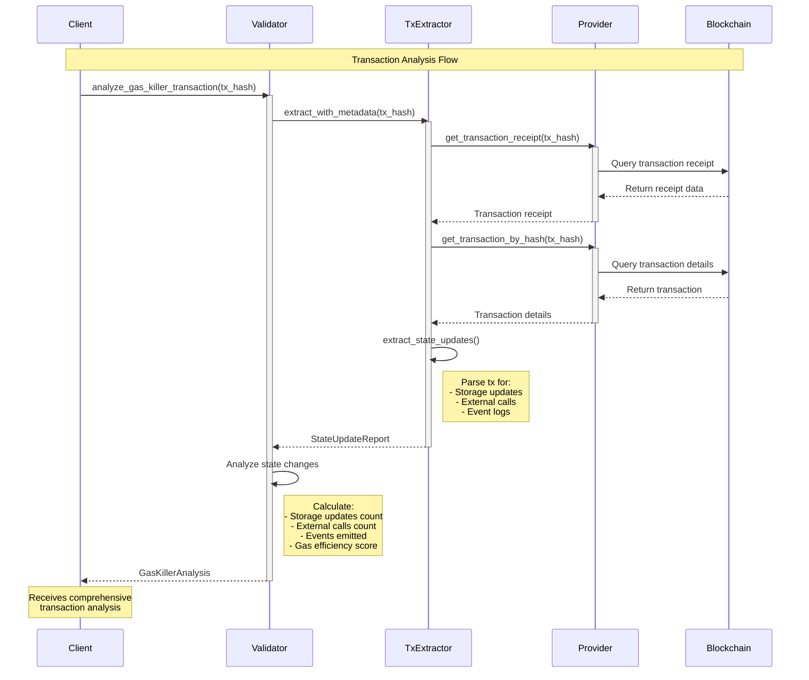
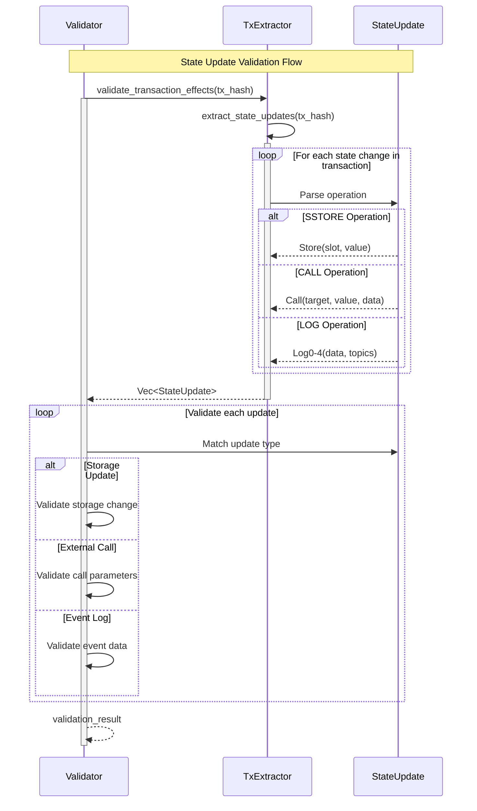

# Transaction Extractor Integration

## Overview

This document explains the integration of transaction state extraction functionality into the gas-killer-router validator component. The integration enables the validator to analyze Ethereum transactions, extract state updates, and perform gas efficiency analysis.

## Architecture Changes

### New Components Added

1. **tx_extractor module** (`src/tx_extractor.rs`)
   - Transaction state extraction functionality
   - State update types (Store, Call, Log0-4)
   - Transaction metadata reporting

2. **Enhanced Validator** (`src/validator.rs`)
   - Integrated TxStateExtractor
   - New transaction analysis methods
   - Gas efficiency scoring

## Component Interaction Flow



## State Update Processing



## Key Features

### 1. Transaction State Extraction
- Extracts all state modifications from a transaction
- Identifies storage updates (SSTORE operations)
- Tracks external contract calls
- Captures emitted events (LOG0-LOG4)

### 2. Gas Efficiency Analysis
The system calculates a gas efficiency score based on:
- Total gas used
- Number of state changes
- Formula: `efficiency = (50000 / gas_per_change) * 100`
- Score range: 0-100 (higher is better)

### 3. Comprehensive Transaction Reports
Each analysis provides:
- Transaction metadata (hash, block, from/to addresses)
- Gas consumption metrics
- Categorized state changes
- Efficiency scoring

## API Methods

### Validator Methods

```rust
// Extract raw state updates
pub async fn extract_transaction_state(&self, tx_hash: FixedBytes<32>) 
    -> Result<Vec<StateUpdate>>

// Extract with full metadata
pub async fn extract_transaction_with_metadata(&self, tx_hash: FixedBytes<32>) 
    -> Result<StateUpdateReport>

// Validate transaction effects
pub async fn validate_transaction_effects(&self, tx_hash: FixedBytes<32>) 
    -> Result<bool>

// Comprehensive gas analysis
pub async fn analyze_gas_killer_transaction(&self, tx_hash: FixedBytes<32>) 
    -> Result<GasKillerAnalysis>
```

## Data Structures

### StateUpdate Enum
```rust
enum StateUpdate {
    Store(StoreUpdate),    // Storage modifications
    Call(CallUpdate),      // External calls
    Log0(LogUpdate),       // Events without topics
    Log1(LogUpdate),       // Events with 1 topic
    Log2(LogUpdate),       // Events with 2 topics
    Log3(LogUpdate),       // Events with 3 topics
    Log4(LogUpdate),       // Events with 4 topics
}
```

### GasKillerAnalysis Struct
```rust
struct GasKillerAnalysis {
    tx_hash: FixedBytes<32>,
    block_number: u64,
    from: Address,
    to: Option<Address>,
    gas_used: u128,
    storage_updates: usize,
    external_calls: usize,
    events_emitted: usize,
    total_state_changes: usize,
    gas_efficiency_score: f64,
}
```

## Integration Points

1. **Orchestrator Integration**: The orchestrator can now use the enhanced Validator to analyze transactions during the aggregation process.

2. **HTTP Server Integration**: The ingress HTTP server could expose endpoints for transaction analysis (future enhancement).

3. **Counter Contract Integration**: The Validator maintains its original counter functionality while adding transaction analysis capabilities.

## Usage Example

```rust
// Create validator instance
let validator = Validator::new().await?;

// Analyze a transaction
let tx_hash: FixedBytes<32> = "0x...".parse()?;
let analysis = validator.analyze_gas_killer_transaction(tx_hash).await?;

// Check results
println!("Gas used: {}", analysis.gas_used);
println!("Efficiency score: {:.2}", analysis.gas_efficiency_score);
println!("State changes: {}", analysis.total_state_changes);
```

## Benefits

1. **Enhanced Validation**: Beyond simple round validation, the Validator can now deeply analyze transaction behavior.

2. **Gas Optimization**: Identify inefficient transactions and patterns through efficiency scoring.

3. **State Tracking**: Monitor and validate all state modifications made by transactions.

4. **Debugging Support**: Detailed transaction analysis aids in debugging and optimization.

## Future Enhancements

- [ ] Implement actual transaction tracing (currently simplified)
- [ ] Add support for more complex state analysis patterns
- [ ] Integrate with debug_traceTransaction for deeper insights
- [ ] Add metrics collection and reporting
- [ ] Implement caching for frequently analyzed transactions
- [ ] Add support for batch transaction analysis

## Technical Notes

- The current implementation provides a simplified transaction extraction that doesn't require debug API access
- For production use, a provider with debug API support would enable full transaction tracing
- The gas efficiency scoring algorithm can be tuned based on network conditions and requirements